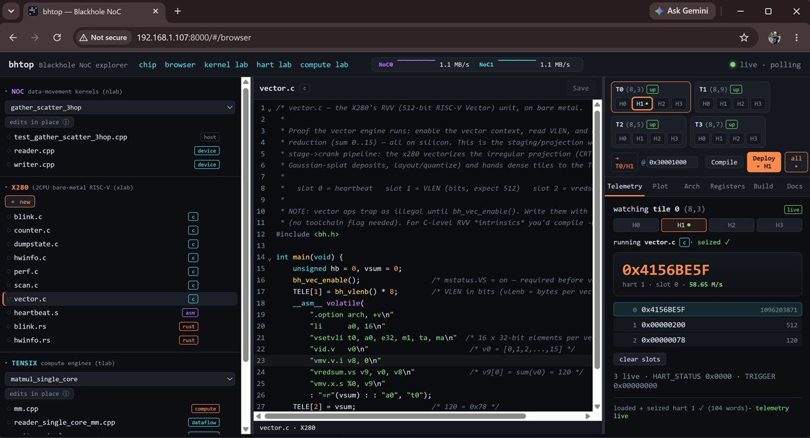
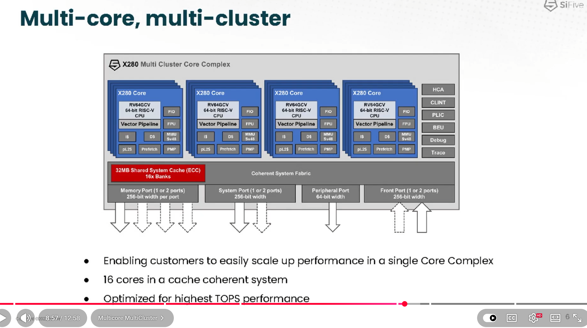

# bhtop

`top` for the Tenstorrent **Blackhole** Network-on-Chip — live NoC telemetry
read straight from the per-tile NIU hardware performance counters.



*The `bhtop-web` cockpit: a device-hierarchy tree (NOC / X280 / TENSIX) on the left, a shared
code editor in the middle, and the live engine pane on the right — here an L2CPU x280 hart
streaming per-slot telemetry (the orange heartbeat counter).*

## Install

```bash
python3 -m venv .venv && . .venv/bin/activate
pip install -e .
bhtop            # live NoC die floorplan
```

## What it does

Blackhole is a tiled mesh: every Tensix / DRAM / Ethernet tile is a node on two
networks-on-chip (NoC0, NoC1). Each tile has two NIUs (NoC interface units), one
per NoC, and each NIU keeps a 62-entry array of free-running 32-bit counters that
tally every read/write/atomic request and every data flit. We poll those counters
over PCIe (via `tt-exalens`), diff successive samples, and render per-tile, per-NoC
bandwidth live.

The view is **NIU-centric**: every link draws **both NoC wires** side by side —
NoC0 east+south (`▸ ▾`, purple), NoC1 west+north (`◂ ▴`, cyan) — the chip-scale
version of the Tensix two-router data-movement diagram. Tiles are heat-coloured by
live per-NoC bandwidth; idle wires recede, live flow brightens.

### Physical vs logical

Every tile carries two silicon coordinates: `die` (physical placement) and `noc0`
(logical 2D-torus index). The NoC is a **folded torus** — the logical numbering is a
column- and row-uniform odd/even interleave (`die→noc0`:
`0,1,16,2,15,3,14,…,8,9`), chosen so the torus *wraparound* wires stay physically
short. Consequences (all verified live from the firmware coords, not asserted):

- Torus **wraparound links are physically short** (die-distance 2) — that's what the
  fold buys; the *physically long* jumps are the **fold seam**, where touching die
  neighbours are up to **8 noc0 hops** apart (a 2→8 gradient, peaking at the apex).
- An interior **"1 logical hop" ≈ 2 physical die cells** — hop count under-reports
  distance ~2×.
- **Nearest-DRAM controller is invariant** physical-vs-logical (hop count picks the
  right bank), but the *distance scale* differs — so trust hops for *which* bank,
  not *how far*. This is what should drive shard-to-core and DRAM-affinity choices.

Two views, toggled with `l`:

- **PHYSICAL** (default) — the real die floorplan from silicon `die` coords,
  rotatable with `r`. Default is **card orientation** (GDDR6 on the top/bottom edges,
  Ethernet left, power/PCIe right — the die mounted 90° on the board); `r`→0° gives
  the **die-geographic** view (DRAM left/right) that matches the official Tenstorrent
  floorplan. *Only "DRAM on two opposite die edges" is a pure silicon fact; which
  physical card edge that is comes from the board photo, and the UI says so.* Nothing
  is fabricated — the real DRAM/Eth tiles land on the real edges.
- **TOPOLOGY** (noc0 coords) — the folded torus the router actually addresses.

Two overlays make the gap legible: **`d` distance** tints each link by its *cross*
length (in PHYSICAL, a link's noc0-hop count, so fold-seam crossings glow red; in
TOPOLOGY, a link's physical die-length); **`f` fold** colours tiles by noc0 index so
the logical ordering is visible snaking across physical space (up-ramp then fold).
The detail panel shows per-tile **DRAM affinity** (physical vs logical nearest) and
flags fold-seam neighbours.

This is the **realtime / live** layer of NoC observability. It complements:
- **tt-smi** — board-level power/clock/temp (not per-link traffic)
- **tt-npe** + ttnn-visualizer — exact per-transaction *trace replay* of a captured
  workload (post-hoc; our live view is the ground-truth cross-check)

## Commands

| command | what |
|---|---|
| **`bhtop`** | **observe** — live NoC telemetry that distinguishes **physical** (die, rotatable) from **logical** (noc0 folded torus); dual-rail NIU links, distance/fold overlays, per-tile DRAM-affinity + fold-seam detail, GDDR6-controller bars |
| **`bhtop --topology` / `--orient 0` / `--no-arrows`** | open in the noc0 torus view / die-geographic orientation / heat-only (compact) |
| **`bhtop-inject`** | **routing & congestion explorer** — drive host traffic from a source Tensix (`WASD` / `r` float) with patterns `1-5` (Tensix↔Tensix gather/scatter/halo + **`5` write to every GDDR6 controller**) and read back the **measured route** (0x500 transit) on the die + per-GDDR6-controller writes-landed flits. This is for *where traffic goes and where it collides*, not peak bandwidth — host injection is hard-capped at 32 B/flit (see below), so for real throughput use `bhtop-metal`. NoC0-only today (W/N destinations wrap) |
| **`bhtop-metal [test]`** | **measure** — run a **tt-metal** on-chip NoC benchmark and visualize its **per-NoC** silicon footprint on the physical die + aggregate bandwidth. The only lane that reaches true 64 B-dense flit throughput (optional; see below) |

```bash
bhtop                              # (l layout · r rotate · d dist · f fold · a arrows · m metric · n NoC · c calib · ↑↓←→ · q)
bhtop-inject                       # streams traffic live (WASD src · 1-5 patterns · 5=write GDDR6 · x stream · f 1-shot · q)
bhtop-metal --list                 # list tt-metal benchmarks (if built)
bhtop-metal AllToAllDirectedIdeal  # run one, see per-NoC footprint + aggregate BW
python3 -m bhtop.floorplan         # dump the tile grid (die + noc0) + DRAM-controller map
```

## Web UI (`bhtop-web`)

A browser app for *exploring* the chip — the real board photo `blackhole_card.png` as a
**zoomable/pannable backdrop** with live NoC/NIU/DRAM bandwidth overlaid, registered to the die
package; hover tooltips and a per-tile **drilldown** page (all NIU counters on both NoCs, DRAM
affinity, fold-seam neighbours). FastAPI + WebSocket backend, Svelte frontend.

```bash
pip install -e ".[web]"            # adds fastapi + uvicorn (TUI install stays lean)
cd frontend && npm install && npm run build   # build the Svelte UI (needs Node 18+)
bhtop-web                          # serve at http://localhost:8000
```

**One device owner:** all PCIe access funnels through a single worker thread (`web/device.py`),
so the chip never sees concurrent access and the hang-hazard gating holds — the poller only ever
touches `tensix/dram/eth` (verified: 156/163 tiles, 0 management). The overlay sits on the package
*footprint* (tiles aren't visible under the lid); re-tune `CARD_PACKAGE_PX` in `geometry.py` if it
drifts. Inject + kernel-deploy panels build on this same serialized owner. Dev: run the backend on
`:8000` and `npm run dev` for the Vite server (it proxies `/api` + `/ws`).

### Device browser & labs (`#/browser`)

A unified **develop → deploy → observe** cockpit (the screenshot above): a left **device-hierarchy
tree** with sections for **NOC** (data-movement kernels), **X280** (L2CPU bare-metal RISC-V), and
**TENSIX** (compute engines) — plus DRAM/ETH stubbed for later. Selecting a source file switches
the right pane to that engine's view: NOC shows Build/Run + per-NoC footprint, TENSIX shows
per-engine occupancy + disassembly, X280 shows tile/hart deploy controls + live per-hart telemetry.
File ops are capability-aware — X280 edits a private workspace (new/duplicate/rename/delete), while
NOC/TENSIX edit the real tt-metal sources in place (duplicate-as-scratch; Run JIT-picks up edits).

**Running kernels are tracked by JIT build hash.** With the tt-metal Inspector enabled
(`web/inspector.py`), `/api/running` maps each live kernel `source → hash → program → core coords`,
so the tree badges a file **running** (●) and the editor flags it **stale** once you edit past the
running build — no mtime guessing, and the disassembly correctly assembles all five RISC engines
across their separate hash dirs. The three labs also stand alone at `#/kernel`, `#/hart`, `#/compute`.

## Architecture / dependencies

bhtop's only dependencies are **`tt-exalens` + `rich` + `textual`**. It reads Blackhole's NIU
hardware counters (`0x200` inject/eject, `0x500` router per-port/VC) directly over tt-exalens.

**tt-metal is NOT a dependency.** `bhtop-metal` discovers a tt-metal build at `$TT_METAL_HOME`
(or `~/tt-metal`) at runtime, runs a benchmark as a *subprocess* (tt-metal owns the device for its
run), then — after it exits — reads the per-tile footprint from the profiler CSV and renders it in
bhtop's mesh. Sequential, no concurrent device ownership, no Python coupling. If tt-metal isn't
built, `bhtop-metal` says so and everything else works unchanged.

The interactive `bhtop-inject` is host-orchestrated (drive + watch in real time); the real
concurrent aggregate bandwidth comes from `bhtop-metal` running on-chip kernels.

## Register reference (Blackhole A0)

- NIU register base: **NoC0 `0xFFB2_0000`**, **NoC1 `0xFFB3_0000`** (Tensix/Eth; DRAM mirrors low 32b)
- Counter array: `NIU_BASE + 0x0200`, 62 × 32-bit, read-only
- Flit = 512 bits = **64 bytes**; one "data word" counter increment = one flit
- Key throughput indices: `MST_RD_DATA_WORD_RECEIVED`(3), `MST_{NON,}POSTED_WR_DATA_WORD_SENT`(8,9),
  `SLV_RD_DATA_WORD_SENT`(51), `SLV_{NON,}POSTED_WR_DATA_WORD_RECEIVED`(56,57)

Source: tenstorrent/tt-isa-documentation `BlackholeA0/NoC/{Counters,MemoryMap}.md`.

## Validated findings (measured on ttstar)

1. **Counters are exact.** Host-pushed byte volume matches the flit counters to the
   integer, reproducibly (e.g. 4 MiB → 131072 flits at 32 B/flit, every run).
2. **`flits × 64` = NoC link occupancy** (wire bandwidth), since a flit holds a full
   64 B link slot whether or not the payload fills it. This is the right metric for
   utilization/congestion.
3. **Host-initiated NoC traffic is hard-capped at 32 B/flit (50% link efficiency)**,
   independent of transfer size — and 4 B-mode access collapses to 4 B/flit (16×
   amplification). Peak NoC bandwidth is only reachable from on-chip (Tensix/DRAM)
   transfers → a tt-metal kernel benchmark is required to see true 64 B-dense flits.
4. **Observer effect is quantified:** each full-grid sweep adds ~62 flits/NoC of
   `SLV_RD_DATA_WORD_SENT` to every polled tile (our own counter reads). `app.py`
   calibrates this out; toggle with `c`.

## Idle baseline (no workload)

Ethernet tiles show steady link-keepalive traffic; DRAM tiles show a small
background read trickle (driver/ARC telemetry). Everything else is dark until a
kernel runs.


## Dependents

  + exalens https://github.com/tenstorrent/tt-exalens


## X280 




What are these cores actually good for?
Worth stepping back, because the L2CPU is unusual. Each tile is 4× SiFive X280 — and the X280 isn't a plain control core, it's an AI core: RV64GC plus a 512-bit RVV vector unit and SiFive's matrix/ML extensions. You've got 16 of them, Linux-capable, and — the key thing — sitting directly on the chip's NoC. They can read/write any tile (Tensix L1, GDDR, other tiles' registers) at NoC latency, with no PCIe in the path. The host can only reach the NoC through PCIe + tt-exalens; these cores are inside the fabric.

That one fact — in-fabric access — is what makes them special. Best uses, roughly in order of fit with what you're building:

1. On-chip NoC instrumentation (the bhtop killer app). Use an x280 as a probe living in the fabric: sweep the NoC address map, read every tile's counters, generate precise traffic from inside, and time tile-to-tile latency/bandwidth at resolutions the PCIe path can't touch. This is your reverse-engineering mission, but from a vantage point the host doesn't have. The cockpit already does deploy-live + telemetry — a "NoC probe" kernel that reports findings via telemetry is a tiny step from here.

2. On-chip control plane / dispatch. Run the orchestration that normally lives on the host — command queues, dispatching work to Tensix, synchronization — at NoC latency instead of PCIe round-trips. Big for latency-bound serving (LLM decode).

3. Data-movement / preprocessing engine. Sit between GDDR and Tensix doing gather/scatter, layout conversion, decompression, tokenization, KV-cache management. Keep data on-card, offload the host; the vector unit earns its keep here.

4. Heterogeneous vector compute. Tensix is great at dense dataflow but awkward at irregular/sequential ops. The x280's RVV handles the glue — softmax/sampling, activations, top-k, dynamic shapes, control-flow-heavy code. A Tensix-does-matmul / x280-does-the-rest pipeline.

5. Linux services on the accelerator. Boot Debian (already proven), SSH in, run an on-card agent: monitoring, a model-server control plane, even a fabric debugger. The card becomes a self-contained node.

6. Lights-out fabric monitor. Literally "bhtop-on-chip" — one x280 continuously samples NoC counters, watches for hangs/hotspots, logs traffic, independent of the host.


export TT_METAL_HOME=/home/starboy/tt-metal
cd $TT_METAL_HOME && ./build_metal.sh --build-programming-examples
export TT_METAL_RUNTIME_ROOT=/home/starboy/tt-metal

## Firmware Update

```bash
pip install git+https://github.com/tenstorrent/tt-flash.git
wget https://github.com/tenstorrent/tt-system-firmware/releases/download/v19.11.0/fw_pack-19.11.0.fwbundle
tt-flash flash fw_pack-19.11.0.fwbundle
```

## Frontend Build

```bash
export PATH="/home/starboy/.local/node/bin:$PATH"
cd ~/bhtop/frontend && npm run build
```